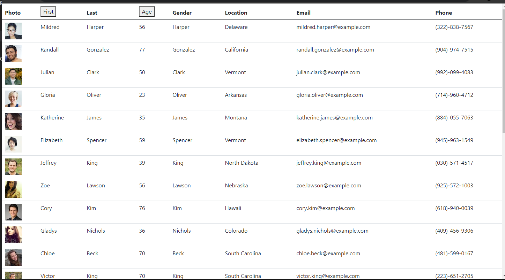
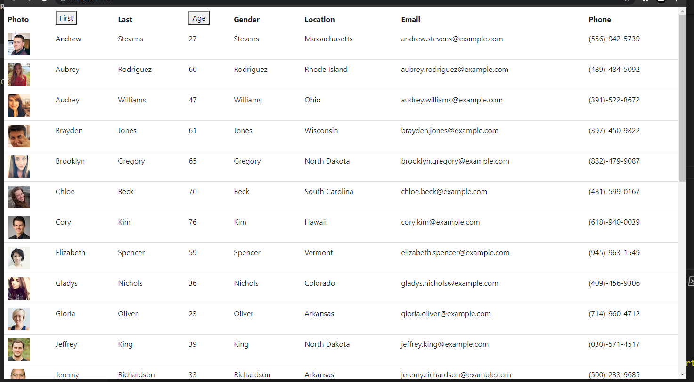
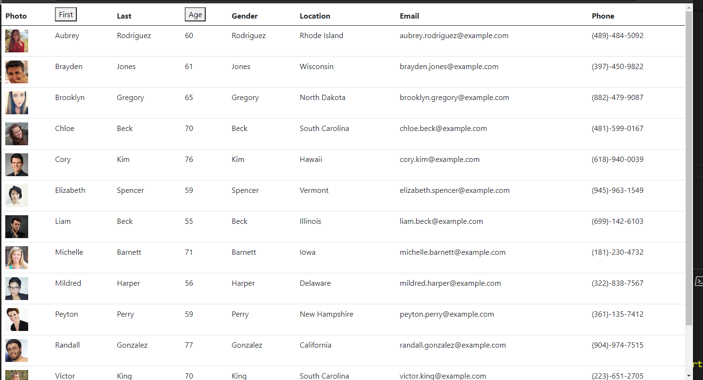

# EmployeeDirectory

## Live Links:

https://github.com/haydenabeck/EmployeeDirectory
https://fierce-bayou-61857.herokuapp.com/

## Contributors

@haydenabeck

## Description:

A small project designed to create a employee directory with React. I wanted to break up this application's UI into components, manage component state, and respond to user events. As a user, I want to be able to view my entire employee directory at once so that I have quick access to their information.

## Table of Contents

- [Installation](#installation)
- [Technology Stack](#technology-stack)
- [Usage](#usage)
- [Screenshots](#screenshots)
- [Live Links](#livelinks)
- [Contact](#contact)

## Installation:

NPM I, NPM START Classic install procedure.

## Technology Stack:

React, Axios, Bootstrap,

## Usage:

The user should be able to:

- Sort the table by at least one category, in this case first name is the button to click to sort information

- Filter the users by at least one property, in this case the age button sorts by people over 50.

## Live Links:

https://github.com/haydenabeck/EmployeeDirectory
https://fierce-bayou-61857.herokuapp.com/

## Screenshots:

- Dashboard

* 

- Alphabetical Sort

* 

- Age Filter

* 

## Contact:

- Hayden Beck - haydenabeck@gmail.com
